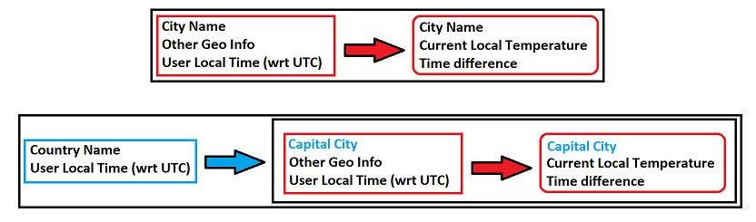

# WeatherTime API

## by Nabeel Vandayar

## Overview

Provide a small web application that produces a simple API with 2 endpoints that returns JSON with the following characteristics.

The problem will be broken down into three parts:

1. Country API: Convert country name to corresponding capital city name.
    * Certain city names are both the capital of a country and a city in another country. For example Dublin in the capital of Ireland and also a city in the USA.
    * Therefore when using the country API, the search must be limited to the country specified. It is not sufficient to search using city name alone.
    * [RESTCountries](https://restcountries.eu/#api-endpoints-all) open API can be used to get the name of a capital city of any country.
        * The API allows searching by native or partial country name eg (Deutschland/Germany or United States)
1. City API: Get current local temperature of a given city as well as timezone.
    * [OpenWeatherMap](https://openweathermap.org/current#current_JSON) is used to obtain the current data for each city.
    * [API reference documentation](Open_Weather_Map.md) containing response parameters.
    * The timezone calculations show a shift in seconds from UTC time.
        * Cities east of the GMT line have 
1. Time Delta function: Get time difference between the timezone of the person calling the API and the city they search for.

## Performance aspects that are considered:

* Caching
* Distribution

## Usage considerations

* Language options
* Temperature units
* Time difference units
* Country vs City APIs
* Bad request handling
    * Consistent schema returned for both good and bad requests.
* API Key usage management
    * access
    * monitoring
    * throtling
